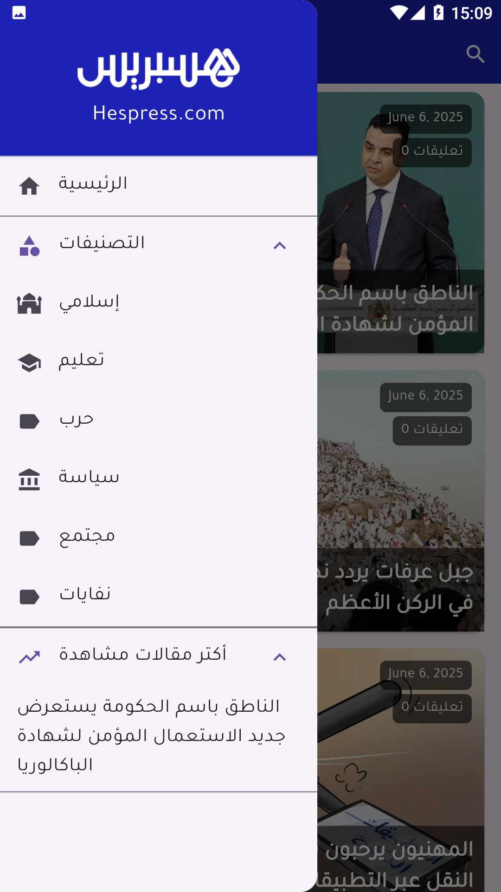

# 📰 Hespress Clone – Flutter + WordPress Plugin

This is a full-stack **Hespress-style news application**, featuring a mobile app built with **Flutter** and a custom **WordPress plugin** that provides a REST API for articles, categories, and comments.

---

## 📦 Features

- 📰 Display latest news articles
- 📚 Filter by categories
- 🔍 Search functionality
- 🧭 Navigation Drawer
- 🌐 Arabic RTL support
- 💬 Comments & Post details
- ☁️ Data fetched from WordPress REST API
- 🛠️ Plugin: Custom-built WordPress API endpoints

---

## 📱 Screenshots

### 🏠 Home Page  


---

### 📂 Navigation Drawer  


---

### 📰 Post Page  


---

### 🔍 Search Page  


---

## 🔧 Setup Instructions

### 📱 Mobile App (Flutter)

```bash
cd mobile
flutter pub get
flutter run
